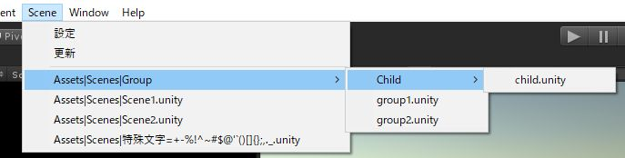
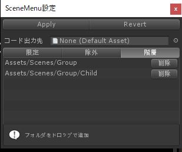

# SceneMenu

メニュー上にシーン一覧が表示され、作業シーンの移動をアシストしてくれる。<br>
シーンファイルを編集/追加/削除した際に自動的に更新される。



## パッケージファイル

[パッケージファイルはココ](./SceneMenu.unitypackage)<br>
※サンプルは含まれていません


## カスタマイズ

メニュー表示用コードが生成される先を変更したり、<br>
メニューに表示されるシーンを限定したり、除外したり、階層を持たせたりできます。

### 調整ウィンドウを起動
 
> Menu > Scene > 設定



```
【Apply】 この設定でメニュースクリプトを生成
【Revert】 前の設定に戻す

【コード出力先】 自動生成されるスクリプトの出力先フォルダ

【限定】　シーンの検索対象が限定される
【除外】　そのフォルダを検索対象外とする
【階層】　メニュー上で１階層下げる（まとめる）
```

### 設定保存先

ProjectSettings/SceneMenuSettings.txt