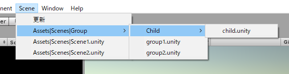
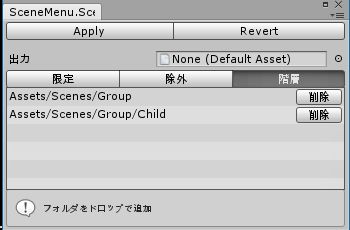

SceneMenu
================

Abstract
--------

メニュー上にシーン一覧が表示され、作業シーンの移動をアシストしてくれる




Usage
--------

* 「Menu > Scene > 設定」



```
【Apply】 この設定でメニュースクリプトを生成
【Revert】 前の設定に戻す

【出力】 自動生成されるスクリプトの出力先フォルダ

【限定】　シーンの検索対象が限定される
【除外】　そのフォルダを検索対象外とする
【階層】　メニュー上で１階層下げる（まとめる）
```

License
-------

The script files in this repository are in the public domain. You can copy and paste it without permission or attribution.
